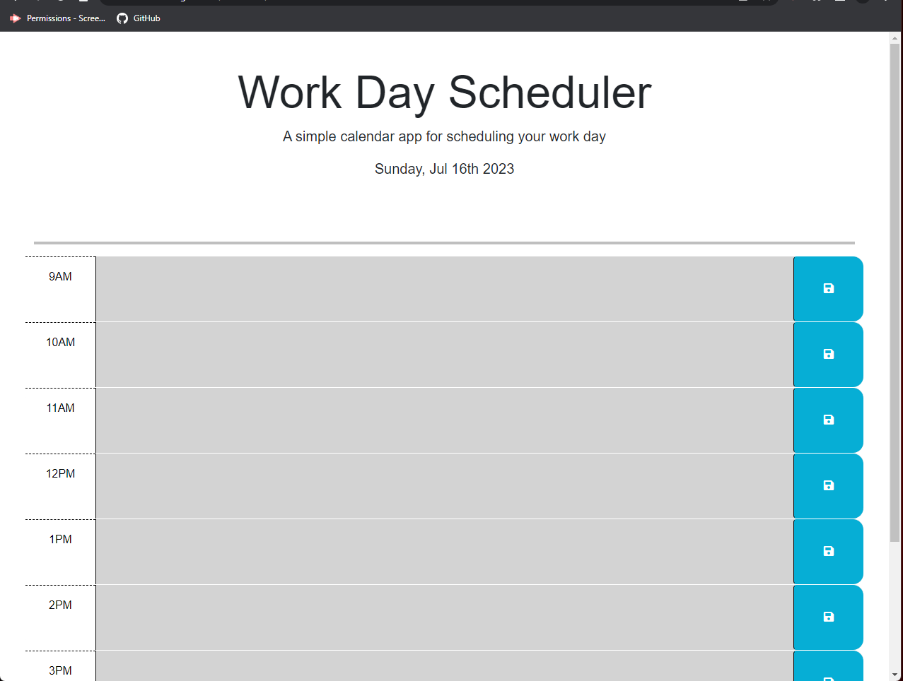

# Work Day Scheduler Starter Code

## This weeks assignment was to create a work day schedule with the normal work hours of 9am to 5pm each with their own text areas, a save button, and color coded depending if the scheduled event was in the past, present, or future. It was definitely a challenging assignment between getting the dayjs and color coordination to work correctly but I feel pretty successful after getting help from my tutor, the TAs, and some fellow students.

## https://bwilliams-88.github.io/scheduler/
